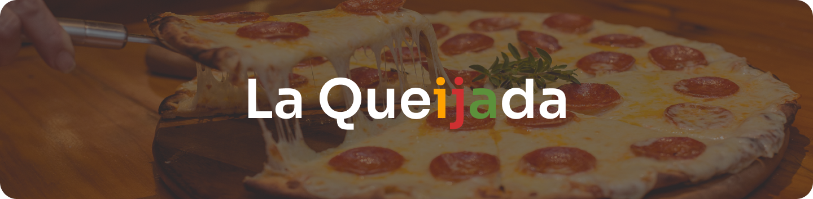

<h1 align="center">
  
</h1>

Uma simples landing page de uma pizzaria fictícia chamada <strong>La Queijada</strong>.

  <a href="README.md">Inglês</a>
  ·
  <a href="README-pt.md">Português</a>

 

  <a href="https://github.com/darrow12">
    &logo=github" alt="Feito por Darrow" title="Feito por Darrow">
  </a>

  &logo=" alt="Licença" title="Licença">

  

  

 
 
 

## 📃 · Sobre o projeto

Uma simples landing page de uma pizzaria fictícia chamada La Queijada. E eu amo pizza, então por que não fazer um site de uma pizzaria?

A  ideia foi tirada de um dos desafios do Iuri Silva.
Se quiser tentar algum dos desafios dele, <a href="https://www.figma.com/file/Yb9IBH56g7T1hdIyZ3BMNO/Desafios---Codel%C3%A2ndia?node-id=624%3A2">clique aqui</a>.

 

## 🖥 · Layout

Este layout foi desenvolvido pelo <a href="https://www.instagram.com/iuricode/">Iuri Silva</a>, e você pode acessá-lo clicando no botão Figma abaixo.

 
 

## 💡 · Demo

Quer ver como está o projeto? Ele já está no ar!

Clique no link para ver: https://darrow12.github.io/La-Queijada/src/pages/index.html

 

## 🏷️ · Licença
Esse projeto está sob a licença MIT. Veja o arquivo <a href="https://github.com/darrow12/La-Queijada/blob/main/LICENSE">LICENSE</a> para mais detalhes.

 
 
 

Desenvolvido com 💜 por <a href="https://github.com/Darrooooow">Darrow</a>, e provavelmente o <a href="http://iuricode.com/">Iuri Silva</a>
