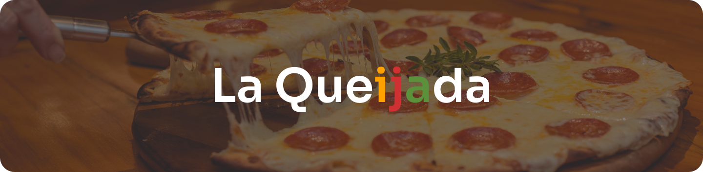

<h1 align="center">
  
</h1>

A simple landing page from a fictional pizzeria called <strong>La Queijada</strong>.

  <a href="README.md">English</a>
  ·
  <a href="README-pt.md">Portuguese</a>

 

  <a href="https://github.com/darrow12">
    &logo=github" alt="Made by Darrow" title="Made by Darrow">
  </a>

  <a aria-label="License MIT" href="https://github.com/darrow12/La-Queijada/blob/main/LICENSE">
    </img>
  </a>
  
  

  

 
 
 

## 📃 · About the project

A simple landing page from a fictional pizzeria called La Queijada. And I love pizza, so why not make a website for a pizzeria?

The idea and the layout was taken from one of Iuri Silva's challenges.
If you wanna try some of his challenges, <a href="https://www.figma.com/file/Yb9IBH56g7T1hdIyZ3BMNO/Desafios---Codel%C3%A2ndia?node-id=624%3A2">click here</a>.

 

## 🖥 · Layout

The Layout was developed by <a href="https://www.instagram.com/iuricode/">Iuri Silva</a>, and you can access it by clicking on the Figma button below.

 
 

## 💡 · Demo

Want to see how the project is doing? It's already on the air!

Click on the link to see: https://darrow12.github.io/La-Queijada/src/pages/

 

## 🏷️ · License

This project is under the MIT license. See the <a href="https://github.com/darrow12/La-Queijada/blob/main/LICENSE">LICENSE</a> file for more details.

 
 
 

Developed with 💜 by <a href="https://github.com/Darrooooow">Darrow</a> and probably the <a href="http://iuricode.com/">Iuri Silva</a>

